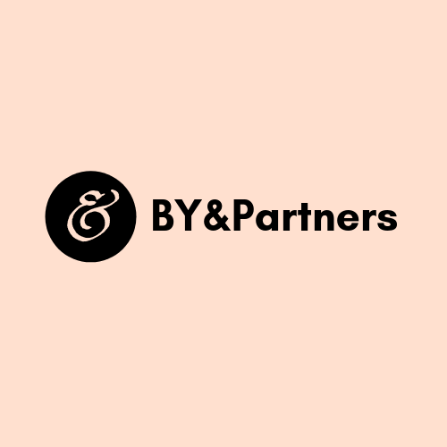

Dear Aileen,

Many thanks for your quick response. I have just talked to my team and we are happy to accept the €2000 price. Thanks very much for understanding the situation and giving us a special quote. Please include an invoice for this quote on delivery of the project.

Also, I'm afraid I'm going to have to be away for a few hours today so I might not be readily available to answer your team's questions. Is there any way we could set up a shared document of sorts so that my team can reply directly to yours without my mediation, in case more questions arise?

Many thanks,
Laura 

--
Dear Aileen,

The articles will be published online, as well as on a special issue of the client's magazine focusing on Irish women in history, aimed at a general (Irish and British mostly) readership. The layout will be the same and indeed should be preserved, but there is a certain flexibility, so the word count does not need to be exactly the same.

Many thanks,

The BY&Partners

--

Dear Laura,

I have a few questions from the translators regarding the audience for this translation.

Can you let me know where the articles will be published, in a magazine or newspaper etc.?   

What type of readership will there be?

Will they be published in exactly the same format as the current documents, and is this layout to be preserved for each language?  

Does the word count need to be similar for each language? 

Thanks for your help,

Regards,
Aileen

--

Dear Aileen,

Many thanks for your message and the information about the translation. I'm afraid, however, that the translation quote you are providing me with is beyond our means at the moment. I understand that this might taking into account the urgency of the project, but I would please ask you to consider that this is for a non-profit client who is working to visibilize Irish women and does not have a large budget.

Please also bear in mind that the texts will be published and we are very happy to name the translators, so this could be a great opportunity for portfolio building. We are currently prepared to invest 1800 euros in this project. Is this something you and your team could consider?

Many thanks in advance,

The BY&Partners team.

--

Dear Laura Linares and Hannah Silvester,

Thank you for your email.  Further to my previous email, I now have a suggested project final price.

For each of the languages I can propose the following:
French
- full translation.  3 articles. 
Spanish
- full translation.  3 articles.
Italian
- partial translation.  Cesca Trench article and Lily Yeats article
Chinese
- partial translation.  Dorothy Price article, plus Cesca Trench article.
German
- partial translation.  Dorothy Price article, plus Lily Yeats article.

This includes translation proofreading, formatting and editing.  

Our proposed pricing for the work above is: € 2,560.

Is meeting in person an option to discuss this further?  Or by phone on 0877811688.

Thank you and Regards,

Aileen

Dear Aileen,

Many thanks for your quick response and your availability to collaborate in this project. We would love to have as much text translated today as possible, but we fully understand that the urgency of the project might not allow it. All texts are equally relevant so we are happy to follow your recommendation for Italian, Chinese and German. If there are any changes in availability, we would please ask you to let us know as soon as possible.

The texts will be used for publication, so we would need full quality control and the utmost quality in the translation, please.

Many thanks again,

BY&Partners.

--
Dear Laura and Hannah,

Thank you for your translation proposal, and for giving us the opportunity to perform this work. I acknowledge receipt of 3 files for translation, which we have reviewed.  They are comprehensive documents and will require attention during translation. We find that
 a machine translation or translation memory will not assist in the translation, and that a human translation will be necessary.  

We have comprehensive language skills in the five languages including native speakers who are ready to translate today. However, we have full resources available for Spanish and French to perform the task and translate three articles fully, but partial resources
 who will be able to translate two of the three articles in Italian, Chinese, and German. Do you have any preference for which articles they should translate today? We would suggest the two shorter articles for Italian, and the longer Dorothy Price article
 and one of the two shorter articles for German and Chinese.

We are currently working on our pricing for this translation job. What level of translation is needed for this project today - full quality control or light review?

Thank you for your help,

Regards,
Aileen
--
Dear friends,

We hope this email finds you well. We are writing to you because one of our clients has requested the translation of three documents into the following languages:

- French
- Spanish
- Italian
- German
- Chinese

This is an urgent project, so **we would need to know if it can go ahead before 11am this morning**, and we would need the **translation finished for 3pm today**. Could you please reply as soon as possible with information about your availability for each language (partial or total), and a final price (including translation, proofreading and formatting).

Please find the files here: 

[FILE 1](https://drive.google.com/open?id=1WSuZW6ITv9ZMuGIwgxlGq1agRAnTOdJC) -- [FILE 2](https://drive.google.com/open?id=1nKJ38emkiNsg-SjAGC60nvuyro_m8MC8) -- [FILE 3](https://drive.google.com/open?id=1STx3hLzOYfEmEgSA_wVgfPUrIHEr7tM6)

Also, could we please ask you that you send us the name of your point of contact so that we can be updated about the project and can answer queries if they arise? What is the easiest way to communicate with your team?

Many thanks in advance.

Kind regards,

**The BY&Partners Team**

